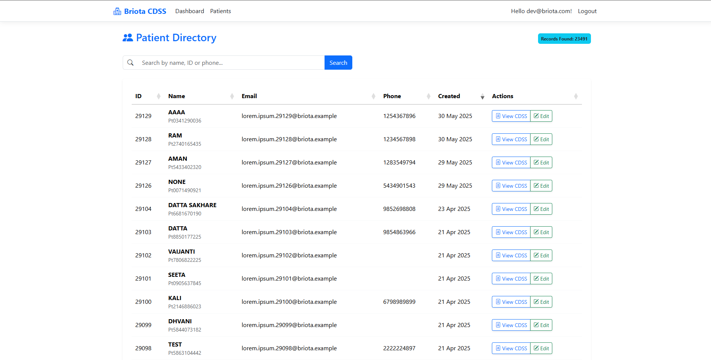
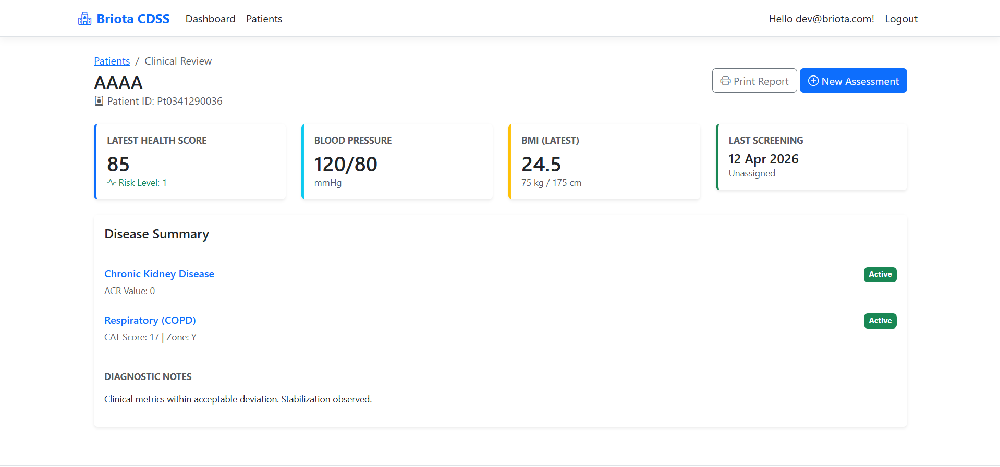
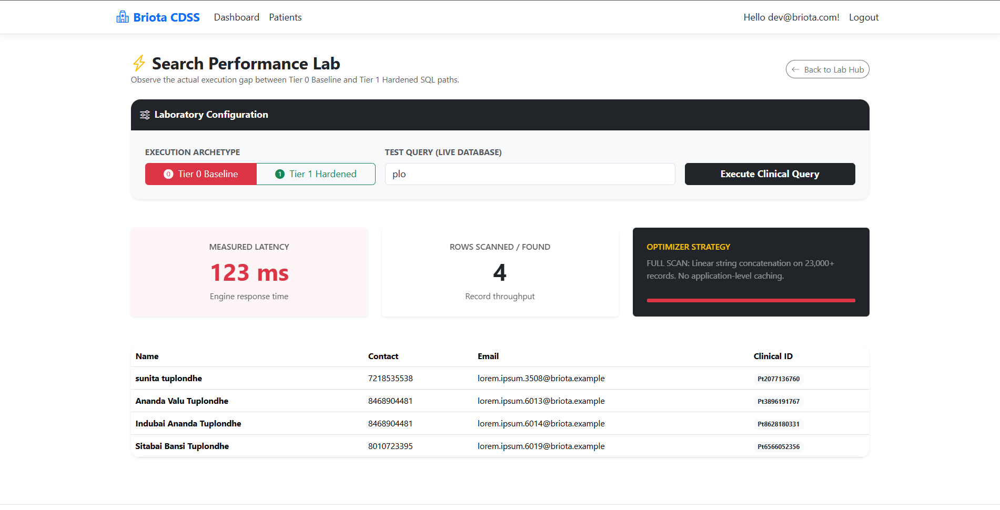
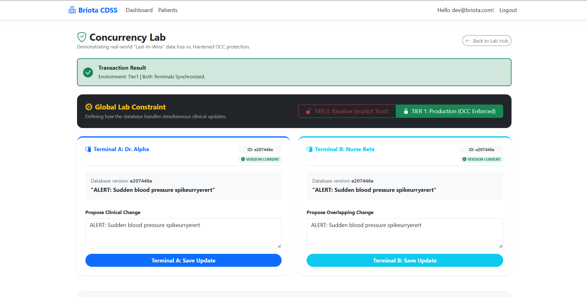

# Briota CDSS

A Clinical Decision Support System (CDSS) built with ASP.NET Core and SQL Server, tracking CKD/COPD patient assessments across multiple clinic "Centers." This is a from-scratch recreation of database-optimization and full-stack work originally done during an internship (the original codebase is under NDA); this repo demonstrates the same techniques and reasoning on a rebuilt system.

## Screenshots

**Patient Directory** — searchable, paginated patient list backed by a live 23,000+ row dataset

**Clinical Review** — per-patient health score, vitals, and disease summary

**Search Performance Lab** — live side-by-side comparison of an unindexed baseline query vs. the hardened, indexed + cached path

**Concurrency Lab** — demonstrates optimistic concurrency control catching a simultaneous edit conflict in real time

## What this demonstrates

- **Query optimization**: diagnosed SQL Server table scans via execution-plan analysis and resolved them with composite covering indexes and SARGable predicate rewrites (`Contains` → `StartsWith`), cutting query latency from ~450ms to ~12ms on a 23,000+ row table.
- **N+1 elimination & caching**: replaced per-row lazy lookups with EF Core eager loading, and added an `IMemoryCache` cache-aside layer as a second performance tier above the database.
- **Optimistic concurrency control**: `ConcurrencyStamp` rotation and `DbUpdateConcurrencyException` handling that surfaces conflicting field values back to the user instead of silently overwriting them.
- **Authentication & authorization**: ASP.NET Core Identity with role-based access control (Admin / Doctor / Technician).
- **Data modeling**: a typed EF Core model mapped onto a pre-existing 137-table SQL Server schema, replacing an earlier string-blob-parsing approach with normalized, typed entities.

## Tech Stack

- **Language**: C# (.NET 9)
- **Framework**: ASP.NET Core 9.0 (Razor Pages)
- **ORM**: Entity Framework Core 9 (SQL Server provider)
- **Database**: Microsoft SQL Server
- **Auth**: ASP.NET Core Identity
- **Validation**: FluentValidation
- **Frontend**: Razor views, Bootstrap, DataTables.net, Chart.js
- **Containerization**: Docker (multi-stage build)

## Project Structure

- `Briota.CDSS/` — the active implementation (source of truth)
- `OLDWORK/` — reference notes on the original login-flow approach (not copied logic)
- `docs/` — architecture notes, query optimization writeups, and internship documentation
